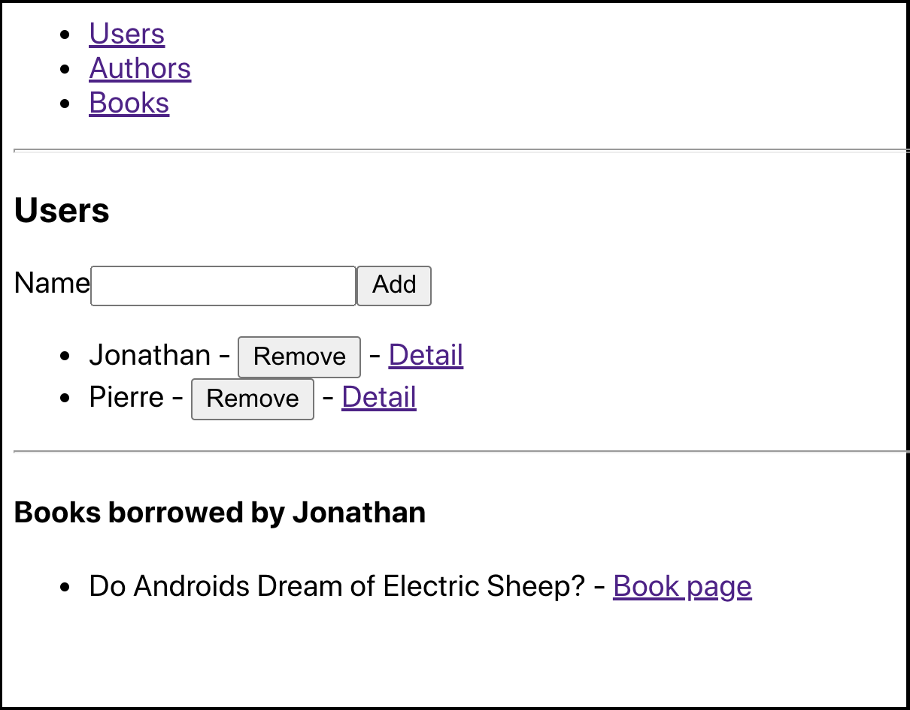
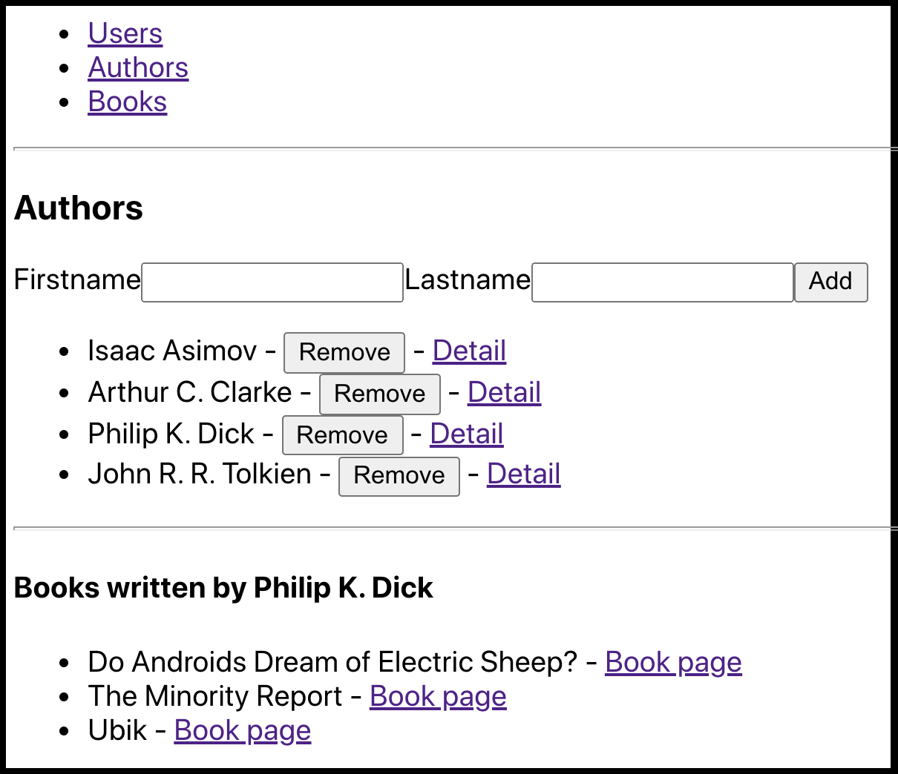
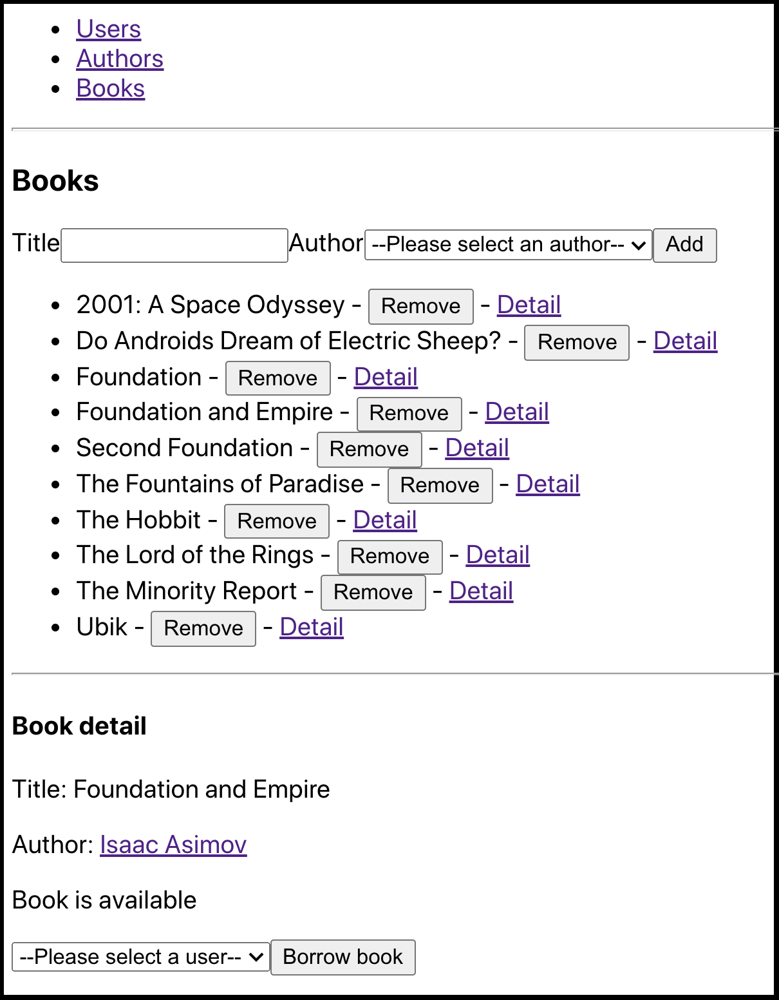
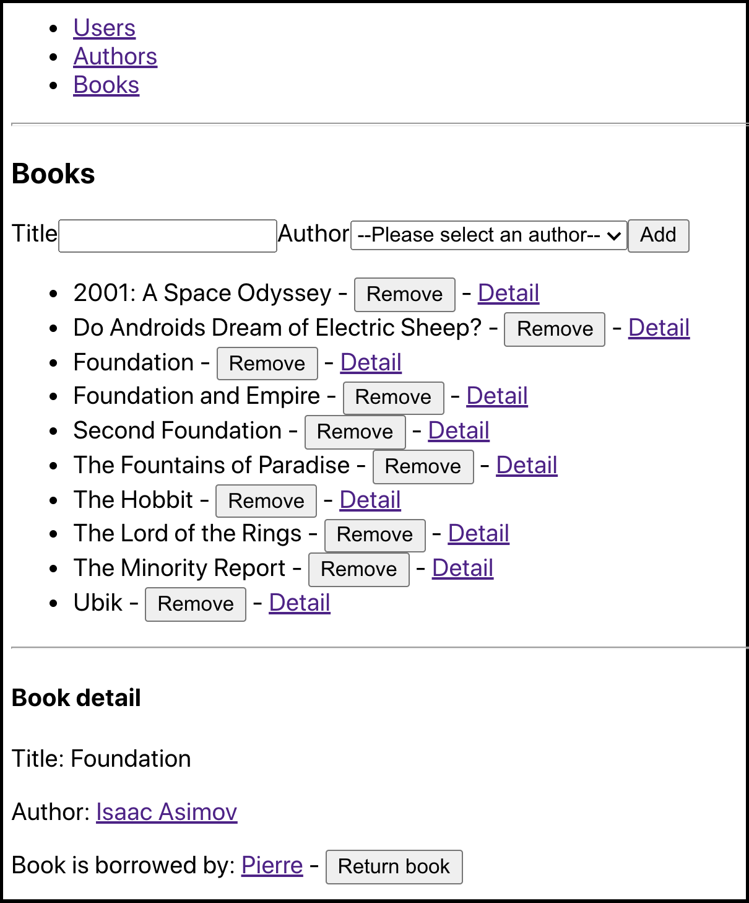

# LP2 - TP noté

Vous allez écrire une application web permettant la gestion d'une bibliothèque.
Cette application est composée :
 - d'une API HTTP (fournie)
 - d'un client web développé avec la bibliothèque React (à réaliser)

# Modèle de données

Le modèle de données est le suivant :
- `User` : représente un utilisateur
  - `name` : nom de l'utilisateur
- `Author` : représente un auteur
  - `firstname` : prénom de l'auteur
  - `lastname` : nom de l'auteur
- `Book` : représente un livre
  - `title` : titre du livre
  - `AuthorId` : identifiant de l'auteur du livre
  - `UserId` : identifiant de l'utilisateur ayant emprunté le livre (ou `NULL`)

Un `Book` peut être soit disponible (quand `UserId` vaut `NULL`), soit emprunté par un seul `User`.

# API HTTP

L'API HTTP est fournie dans le dossier `server`. Elle expose les routes suivantes :
 - `GET /user` : obtenir l'ensemble des `User`
 - `POST /user {name}` : créer un nouveau `User`
 - `DELETE /user/:id` : supprimer un `User` existant
 - `GET /author` : obtenir l'ensemble des `Author`
 - `POST /author {firstname, lastname}` : créer un nouvel `Author`
 - `DELETE /author/:id` : supprimer un `Author` existant
 - `GET /book` : obtenir l'ensemble des `Book`
 - `POST /book {title, AuthorId}` : créer un nouveau `Book` (lors de sa création, un `Book` doit appartenir à un `Author`, mais n'appartient à aucun `User`, i.e. il est disponible)
 - `DELETE /book/:id` : supprimer un `Book` existant
 - `GET /author/:id/books` : obtenir l'ensemble des `Book` d'un `Author`
 - `GET /user/:id/books` : obtenir l'ensemble des `Book` d'un `User`
 - `PUT /book/:id {UserId}` : modifier un `Book` existant (si on fournit une propriété `UserId` (potentiellement `null`) on modifie l'identité de l'emprunteur)

Cette API utilise un fichier de données `SQLite` local et ne nécessite aucun serveur de base de données.
Pour la démarrer, il suffit d'aller dans le dossier `server`, puis de lancer les commandes :
```sh
npm install
node server.js
```

> **Des fonctions permettant de faire appel à toutes ces routes sont déjà fournies pour le client, comme décrit plus loin ci-dessous**

# Client web

Le client web doit proposer des interfaces permettant de :

 - gérer les `User` (route `/users`) :
   - liste des `User`
   - ajout/suppression d'un `User`
   - détails d'un `User` (route `/users/:userId`) :
     - affichage de la liste de ses `Book` empruntés, avec pour chaque `Book` un lien permettant de se rendre au détail du `Book`

Exemple (pour la route `/users/2`) :



 - gérer les `Author` (route `/authors`) :
   - liste des `Author`
   - ajout/suppression d'un `Author`
   - détails d'un `Author` (route `/authors/:authorId`) :
     - affichage de la liste des `Book` écrits, avec pour chaque `Book` un lien permettant de se rendre au détail du `Book`

Exemple (pour la route `/authors/3`) :



 - gérer les `Book` (route `/books`) :
   - liste des `Book`
   - ajout/suppression d'un `Book`
   - détails d'un `Book` (route `/books/:bookId`) :
     - affichage du titre, de l'auteur (ainsi que d'un lien permettant de se rendre au détail de l'`Author`)
	 - affichage de l'état (disponible ou emprunté)
	 - si le `Book` est disponible : formulaire permettant de l'associer à un `User`
	 - si le `Book` est emprunté : affichage du `User` (ainsi que d'un lien permettant de se rendre au détail du `User`) et d'un bouton permettant de "rendre" le `Book`

Exemples (pour les routes `/books/2` et `/books/1`) :




# Indications & Rappels

Pour développer, vous partirez de l'état actuel du dossier `client` fourni.
Ce projet a été généré avec `create-react-app`.
Tout ce que vous avez à faire est d'exécuter la commande :
```sh
npm install
```

Pour travailler vous pouvez ensuite lancer :
```sh
npm run start
```

Le fichier `books_api.js` exporte un objet qui contient déjà l'ensemble des fonctions permettant de dialoguer avec l'API (les fonctions sont écrites ici dans l'ordre de la description des routes ci-dessus).
Chacune de ces fonctions retourne une Promise.

## Paramètres des routes client

On peut récupérer les paramètres des routes à l'aide du hook `useParams` fourni par `react-router`.
Attention cependant au fait que tout ce qui est issu du parsing de la route est du type `string`.
Si on récupère un identifiant dans une route paramétrée et que l'on souhaite l'interpréter comme un `number`, il faut utiliser la fonction `parseInt`.

_Exemple_ :
```js
// la route courante est /lists/3
// et nous sommes sous un composant <Route path="/lists/:listId">
let { listId } = useParams();  // ici listId est une chaîne de caractères
listId = parseInt(listId); // ici c'est un nombre
```

## react-query

La documentation de la v2 de `react-query` (version que l'on a commencé à utiliser, et que vous récupérez lors du `npm install` du client) est disponible ici : [https://react-query-v2.tanstack.com/docs](https://react-query-v2.tanstack.com/docs).

Le site officiel de la bibliothèque donne maintenant la documentation de la v3, sortie entre temps, et qui comporte quelques modifications majeures par rapport à ce que l'on a vu.

Les indications qui suivent concernent la v2.

**`useQuery(key, asyncFunc)`**

Permet d'obtenir le contenu (`data`) (et d'autres informations (`isLoading`, `isError`, ...)) de l'entrée de cache correspondant à la clé `key` et obtenu grâce à la fonction asynchrone `asyncFunc`.

_Exemples_ :
```js
let { isLoading, isError, error, data } = useQuery('lists', listAPI.getLists);
// la clé est une chaîne de caractères

let { isLoading, isError, error, data } = useQuery(['listitems', 3], () => listAPI.getListItems(3));
// ici la clé est un tableau composé d'une chaîne et d'un nombre
```

**`useQueryCache()`**

Permet d'obtenir une variable représentant le cache courant.

_Exemple_ :
```js
let queryCache = useQueryCache();
```

**`queryCache.getQueryData(key)`**

Permet d'obtenir directement le contenu actuel du cache correspondant à la clé `key` (ou `undefined` si cette entrée n'existe pas).

_Exemple_ :
```js
let items = queryCache.getQueryData(['listitems', 3]);
```

**`queryCache.setQueryData(key, updateFunc)`**

Permet de modifier directement le contenu du cache correspondant à la clé `key`. La fonction `updateFunc` sera appelée avec le contenu actuel du cache et doit retourner le nouveau contenu par lequel le remplacer.

_Exemple_ :
```js
let newItem = { ... };
queryCache.setQueryData(['listitems', 3], items => [...items, newItem]);
// un nouvel élément est ajouté dans le tableau d'items correspondant à cette entrée de cache
```

**`let [mutate] = useMutation(asyncFunc, { onSuccess })`**

Permet d'obtenir une fonction `mutate` qui déclenchera l'appel à la fonction asynchrone `asyncFunc` fournie. En cas de succès, la fonction `onSuccess` sera appelée avec en paramètres : les données de résolution de la fonction asynchrone, puis le paramètre qui avait été fourni lors de l'appel à `mutate`.

_Exemple_ :
```js
let [addItem] = useMutation(listAPI.addItem, {
  onSuccess: item => queryCache.setQueryData(
    ['listitems', 3],
      items => [...items, item]
  )
});
// les données de résolution de la fonction listAPI.addItem est le nouvel item
// en cas de succès, on modifie l'entrée de cache correspondant à la liste 3 (exemple) pour y ajouter ce nouvel élément
```

## Combo box

Pour gérer une combo box, on utilise un élément `<select>`.
Si l'on dispose d'un tableau d'objets ayant chacun un identifiant, on peut sélectionner l'identifiant d'un élément par exemple de la façon suivante :
```js
let [selectedId, setSelectedId] = useState(0);

let objects = [
    { id: 1, prop1: 'bla', prop2: 'bla' },
    { id: 2, prop1: 'bli', prop2: 'bli' },
    { id: 3, prop1: 'blu', prop2: 'blu' }
];

return <form>
    <select value={selectedId} onChange={e => setSelectedId(parseInt(e.target.value))}>
        <option key={0} value={0}>--Please select an object--</option>
        {objects.map(o => <option key={o.id} value={o.id}>{o.prop1} {o.prop2}</option>)}
    </select>
</form>;
```
